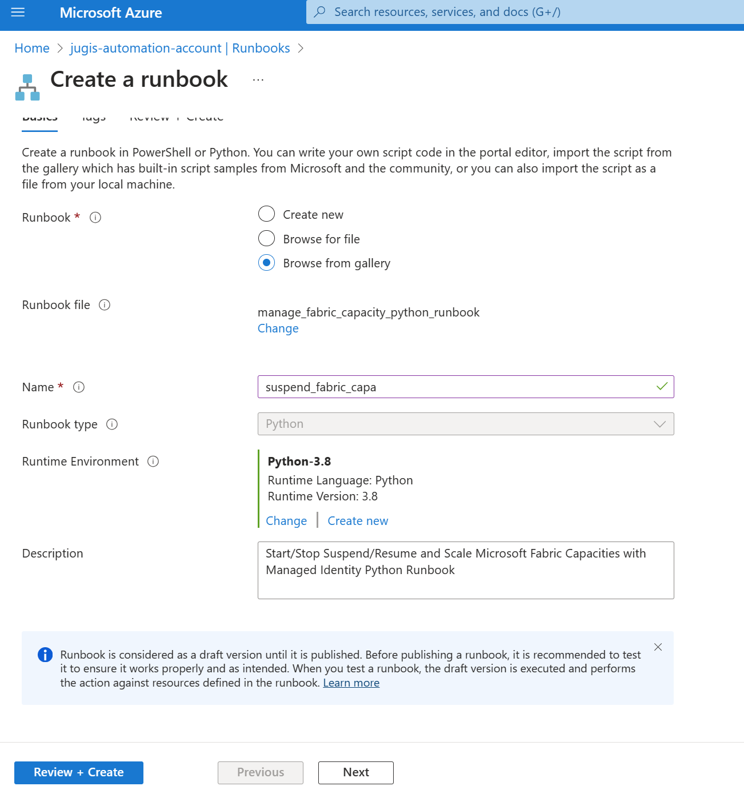
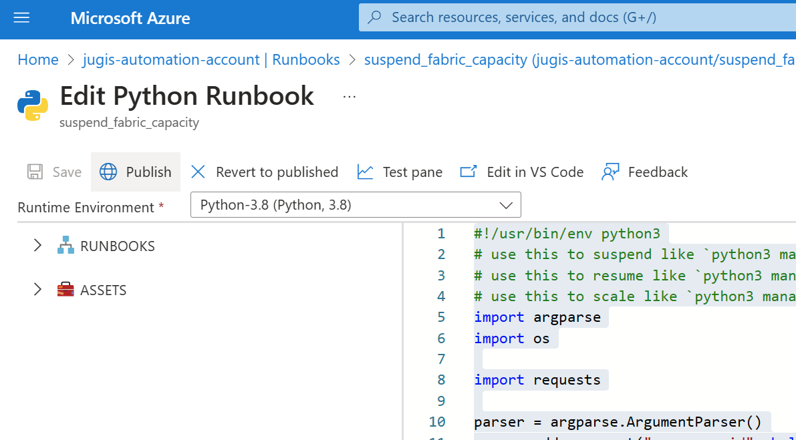

# Suspend or Resume Fabric Capacity

## Usage
### Python
Use the python script via command line like 
```
python3 manage_fabric_capacity.py.py /subscriptions/12345678-1234-1234-1234-123a12b12d1c/resourceGroups/fabric-rg/providers/Microsoft.Fabric/capacities/myf2capacity suspend
```

### Parameters
#### Resource ID (required):
    Resource ID of the Capacity, can be found in the Azure Portal on the resource overview page in the top right when clicking on JSON View.
#### Operations (required):
    Can be either suspend, resume or scale
#### SKU (optional):
    Required if operation = scale, some SKU between F2 to F2048

## Azure Automation Runbook
To use the script as an Azure Runbook, the authentication will happen via the System Assigned Managed Identity of the Automation Account. That identity will need to have contributor rights on the Fabric Capacity resource.

Create Runbook:


Choose from Gallery:


Search Gallery for "Fabric":


Name the Runbook and select Python Runtime:


Publish the runbook:


Go to schedules:


Get Ressource ID of your Fabric Capacity


Copy the Ressource ID


Put Capacity ID and the Operations (e.g. "suspend") as parameter


Create Identity for Automation Account and copy the Object ID


On the Fabric Capacity assign the contributor role to the Automation Account Object ID
